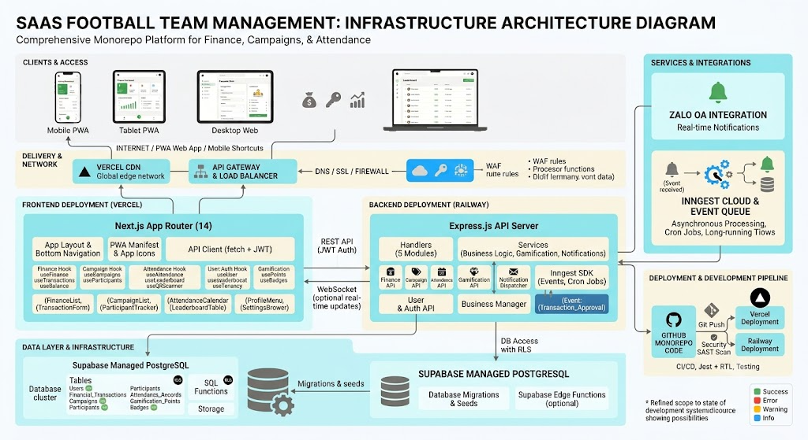

# System Architecture - Football Team Management SaaS 🏈

**Version:** 1.0.0  
**Last Updated:** 2026-06-23  

## 1. Architectural Overview



The Football Team Management platform is built as a highly scalable, multi-tenant SaaS application designed specifically for amateur and grassroots sports teams. It follows a **Monorepo Architecture** separating the client-side Web/PWA application and the server-side API.

The system is designed to be **API-first**, ensuring that the frontend, future mobile apps (React Native), and third-party integrations consume the same core RESTful endpoints.

## 2. High-Level System Design

> **Client Layer** (Mobile/Tablet/Desktop PWA) 
> ↔️ **API Gateway / Load Balancer** > ↔️ **Backend Layer** (Express.js API) 
> ↔️ **Data Layer** (Supabase PostgreSQL)

* **Background Processing:** Inngest Task Queue handles async events & crons.
* **External Integrations:** Zalo OA for real-time notifications.

## 3. Core Technology Stack

### 3.1 Frontend (Presentation Layer)
* **Framework:** Next.js 14 (App Router)
* **Language:** TypeScript (Strict Mode)
* **Styling:** Tailwind CSS 3.3+ & custom Design Tokens (Warm Monochromatic)
* **State Management:** React Context (Auth, Toast) & Custom Hooks
* **PWA:** `next-pwa` with App Shortcuts for offline-ready mobile access

### 3.2 Backend (Application Layer)
* **Runtime:** Node.js 18+
* **Framework:** Express.js
* **Architecture:** MVC & Service-Oriented (Route Handlers -> Services -> DB)
* **Task Queue / Cron:** Inngest SDK (Event-driven asynchronous processing)
* **Notifications:** Zalo OA API Integration

### 3.3 Database & Data Layer
* **RDBMS:** PostgreSQL 12+ (Managed by Supabase)
* **Security:** Row-Level Security (RLS) ensuring tenant data isolation.
* **Migrations:** Standard SQL migrations / ORM tools.

## 4. Monorepo Directory Structure

```text
my_football_team/
├── backend/                    # API Service
│   ├── src/
│   │   ├── app.js              # Entry point & Express initialization
│   │   ├── config/             # Environment & DB configurations
│   │   ├── handlers/           # Request/Response controllers
│   │   ├── middleware/         # Auth, RBAC, Tenancy resolving
│   │   ├── services/           # Core business logic
│   │   └── inngest/            # Background jobs & event functions
│   └── database/               # Schemas, Migrations, Seeds
│
├── frontend/                   # Web Client & PWA
│   ├── app/                    # Next.js 14 App Router routes
│   ├── components/             # Reusable UI components
│   ├── hooks/                  # Data fetching & state logic
│   └── contexts/               # Global state providers
│
└── docs/                       # Architecture diagrams, API specs

```

## 5. Security & Authentication

* **Authentication:** JWT (JSON Web Tokens) stored securely on the client, passed via the `Authorization: Bearer <token>` header.
* **Role-Based Access Control (RBAC):**
* `admin`: Full system control and global configurations.
* `manager`: Team-level management, approvals.
* `member`: View-only access, check-ins, submitting expense requests.
* `guest`: Read-only access to public campaigns/rosters.


* **Data Isolation:** Supabase Row-Level Security (RLS) ensures that database queries automatically filter records based on the authenticated user's `team_id`.

## 6. Business Modules

### 6.1 Finance Module

* **Flow:** Member submits expense -> Manager receives notification -> Manager approves/rejects -> Balance updates.

### 6.2 Campaign Module

* **Flow:** Admin creates campaign -> Draft/Active/Ended states -> Members register -> Attendance linked to campaign.

### 6.3 Attendance & Gamification Module

* **Flow:** Mobile PWA generates/scans QR Code -> API validates location/time -> DB records Check-in -> Service calculates Streaks/Points -> Inngest triggers Badge allocation.

## 7. Deployment Infrastructure (Phase 4)

* **Frontend Hosting:** Vercel (Edge caching, zero-downtime deployments).
* **Backend Hosting:** Railway / Render (Dockerized Node.js containers).
* **Database:** Supabase (Fully managed Postgres with daily backups).
* **Domain & DNS:** Cloudflare (DDoS protection, SSL/TLS).

## 8. Scalability & Future Proofing

* **Asynchronous Processing:** Offloading heavy tasks to **Inngest** keeps the Express event loop unblocked.
* **API Agnosticism:** The Express API is decoupled from the frontend, ensuring a smooth transition for the future React Native mobile application.

